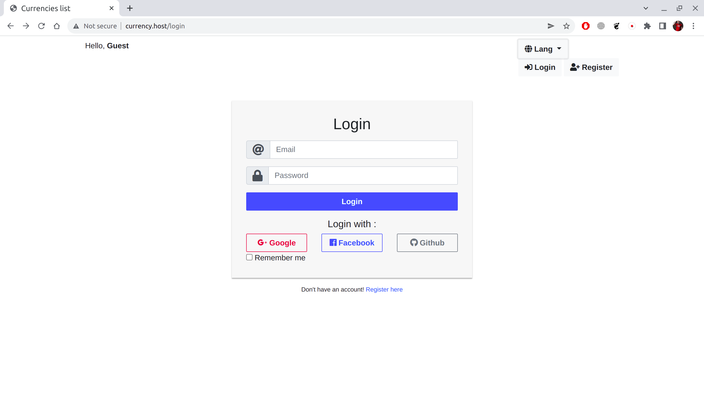
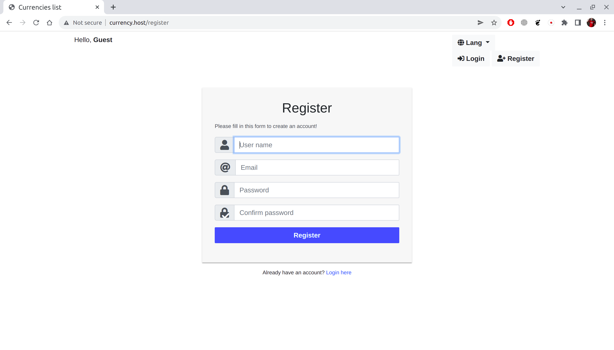
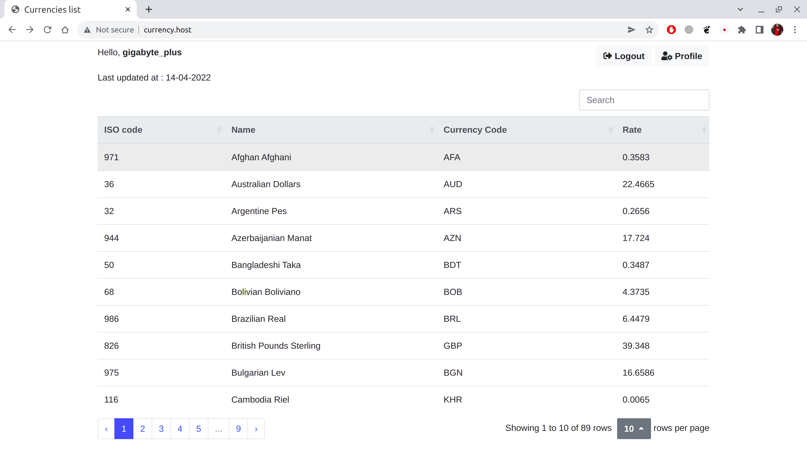
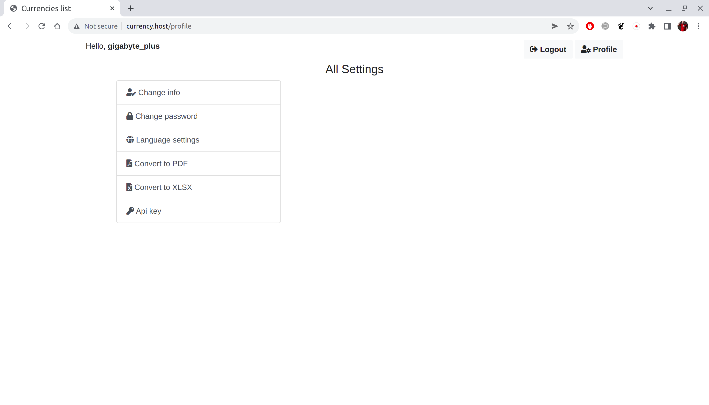
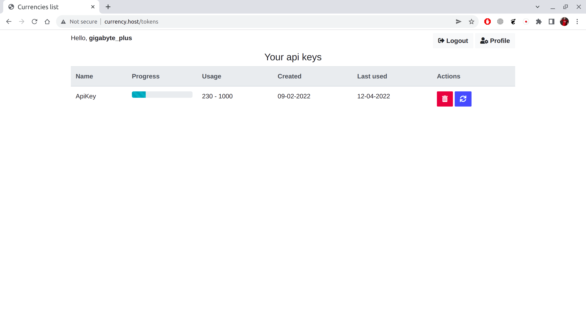

##About

Web application  that shows rate of different currencies. Developed on framework Laravel, version 6.20. Application functionality:  

    - user authorization/registration
    - alternative user authorization via facebook, google, github
    - multilingual interface (English, Ukrainian)
    - automatic DB updating from different external api sources (cron is used)
    - hybrid usage mongoDB and mySQL databases
    - implemented api (bearer token is used for authentication). The information returns in json format, with the ability to specify the base currency
    - control the number of api requests per month according to the tariff plan
    - data generation in pdf and docx formats
Used packages:

    - jenssegers/mongodb
    - guzzlehttp/guzzle
    - laravel/sanctum
    - laravel/socialite
    - barryvdh/laravel-dompdf
    - maatwebsite/excel
    - phpoffice/phpspreadsheet
Frontend used:

    - Bootstrap 4.3.1
    - jQuery 

##How to configure

At first you must rename .env.examle file to .env. Then customize general settings at this file.
You need to set this parameters:
```php
APP_URL
APP_NAME
APP_ENV

#Mysql DB connection settings
DB_CONNECTION=mysql
DB_HOST
DB_PORT
DB_DATABASE
DB_USERNAME
DB_PASSWORD

#MongoDB connection settings
MONGO_DB_CONNECTION=mongodb
MONGO_DB_HOST
MONGO_DB_PORT
MONGO_DB_DATABASE
MONGO_DB_USERNAME
MONGO_DB_PASSWORD

#Mail sending settings
MAIL_DRIVER=smtp
MAIL_HOST
MAIL_PORT
MAIL_USERNAME
MAIL_PASSWORD
MAIL_ENCRYPTION
MAIL_FROM_ADDRESS
```
If you want to use alternative authorization methods you must create app on each resource and fill this parameters:
```php
#Facebook API settings
FB_APP_ID
FB_APP_SECRET

#Github API settings
GH_APP_ID
GH_APP_SECRET

#Google API settings
GOOGLE_APP_ID
GOOGLE_APP_SECRET
```
After that you must create tables in you database. Use this comand in your terminal:
```shell script
php artisan migrate --database=**mysql**
```
It will autiamticaly create all needed tables in your database.
When your tables are creteted, use this comand in your terminal to fill some needed tables:
```shell script
php artisan db:seed
```
For full automatic database updating add one cron config record to your server:
```shell script
* * * * * cd /path-to-your-project && php artisan schedule:run >> /dev/null 2>&1
```
Also you can manually update your data by those comands:
```shell script
php artisan rate:update-from-API enterprise
php artisan rate:update-from-table starter
php artisan rate:update-from-table free
```  
##How to use

Login page:



Register page:



Currency list:



Dashboard:



Api keys control page:



Json api response example (must set authorization type bearer token and send url request http://your_domain/api/v1):

```json
{
    "date": "15.04.2022",
    "timestamp": 1649970000,
    "base": "UAH",
    "rates": [
        {
            "iso_code": 971,
            "name": "Afghan Afghani",
            "currency_code": "AFA",
            "rate": 0.3583
        },
        {
            "iso_code": 36,
            "name": "Australian Dollars",
            "currency_code": "AUD",
            "rate": 22.4665
        },
        {
            "iso_code": 32,
            "name": "Argentine Pes",
            "currency_code": "ARS",
            "rate": 0.2656
        },
        {
            "iso_code": 944,
            "name": "Azerbaijanian Manat",
            "currency_code": "AZN",
            "rate": 17.724
        } ...
    ]
}
```
Also optional can set the base currency like http://your_domain/api/v1/eur:

```json
{
    "date": "15.04.2022",
    "timestamp": 1649970000,
    "base": "EUR",
    "rates": [
        {
            "iso_code": 971,
            "name": "Afghan Afghani",
            "currency_code": "AFA",
            "rate": 91.124477
        },
        {
            "iso_code": 36,
            "name": "Australian Dollars",
            "currency_code": "AUD",
            "rate": 1.45327
        },
        {
            "iso_code": 32,
            "name": "Argentine Pes",
            "currency_code": "ARS",
            "rate": 122.92884
        },
        {
            "iso_code": 944,
            "name": "Azerbaijanian Manat",
            "currency_code": "AZN",
            "rate": 1.842129
        } ...
    ]
}
```
